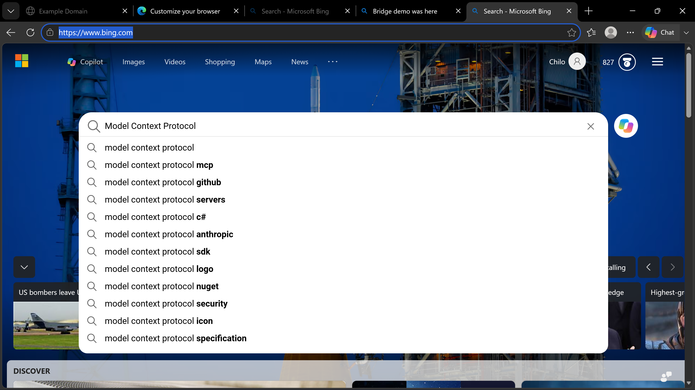
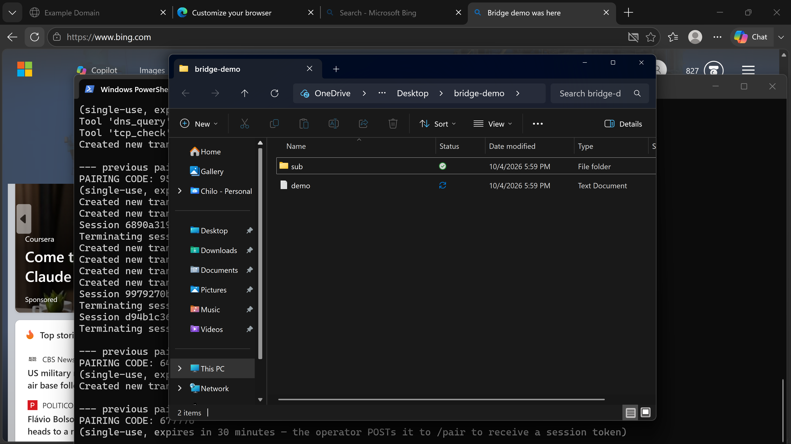

# AlterEgo — the MCP bridge that puts an AI at your PC's keyboard

**AlterEgo gives an AI assistant a second self on a Windows PC.**
Not a sandbox. Not a screenshot API. An AI operator that can see your screen,
drive your mouse and keyboard, run shell commands, manage files, and drive a
real browser — through **63 MCP tools**, with every dangerous action popping
a native **Yes/No dialog on your own screen** that you answer yourself.

> **Live since 2026-10-06** — pairing, authenticated MCP session, and all 63
> tools verified end-to-end against a real Windows PC through the named
> Cloudflare tunnel `pc-bridge` at **https://pc.secscan.info**.

---

## See it work

Proof lives in [`demo-evidence/`](demo-evidence/) — screenshots captured
during real sessions: the AI clicking and filling forms in a live browser,
managing files, driving a terminal, and chatting with the PC through the
three-way WebSocket chat.




---

## How it works (plain words)

1. **You** run the agent on your Windows PC. It starts a server that listens
   on **loopback only** (`127.0.0.1:8765`) — unreachable from the network.
2. Your PC dials **out** through a named Cloudflare tunnel you start yourself
   (`cloudflared tunnel run pc-bridge`). That tunnel publishes the permanent
   address `https://pc.secscan.info`. Nothing phones home.
3. You hand the operator one thing — a **6-digit pairing code** (safe to share:
   cryptographically random, single-use, expires in 30 minutes, locks after 5
   wrong guesses). The operator exchanges it at `POST /pair` for a session
   **bearer token** delivered over TLS.
4. From then on the AI drives your PC through MCP (Streamable HTTP):
   - **Read tools** (screenshot, window list, files in your profile, system
     info) just work — silent, no prompts.
   - **Write tools** (`focus_window`, `type_text`, `shell_exec`, …) each pop
     a native Windows **Yes/No approval dialog on your screen** showing the
     exact action. 30 seconds with no answer = **denied**. No interactive
     session = fail closed. You are the final say on everything the AI tries.
5. Every call — read and write — is appended as a typed event to an
   **event-sourced operation log** (`%APPDATA%\pc-mcp-bridge\events\`, one
   JSONL file per day), queryable with `query_events` and replayable with
   `replay_session`.
6. There's also a **three-way WebSocket chat** (operator + PC-side agent +
   you) so the humans and the AIs stay in one conversation.

## Quickstart

**PC owner (5 minutes):**
```powershell
git clone https://github.com/cc4480/alterego
cd alterego
python -m pip install -r pc-agent\requirements.txt
python pc-agent\server.py            # prints your 6-digit pairing code
cloudflared tunnel run pc-bridge    # second terminal
```
Full walkthrough: [docs/setup.md](docs/setup.md)

**Operator:**
```bash
export PC_BRIDGE_URL=https://pc.secscan.info
python3 bridge/op_call.py pair 279416        # exchange the code for a token
python3 bridge/op_call.py tools              # 63 tools
python3 bridge/pc_bridge.py screenshot --out /tmp/shot.png
```
Full walkthrough: [docs/operator.md](docs/operator.md)

**No PC?** Try the mock server: [Quick test](#quick-test-no-pc-needed)

---

## Security model

- **Loopback only.** The server binds `127.0.0.1`. The only inbound path is
  the outbound Cloudflare tunnel the PC owner starts themselves.
- **Pairing, not pre-shared secrets.** The 6-digit code expires in 30
  minutes and can't be reused. The bearer token is persisted on the PC
  (`%APPDATA%\pc-mcp-bridge\session_token`) so it survives restarts, and
  lasts until logout — deleting that file revokes it **instantly**, even
  while the server is running. Re-pairing rotates it.
- **The tunnel URL is not a secret** — it's just the address. The bearer
  token is the authentication.
- **Approval-gated writes.** Native Yes/No dialogs for every write tool;
  30s timeout = deny; no interactive session = fail closed. Destructive
  tools (`power`, `kill_process`, `delete_file`, `shell_exec`,
  `shell_pwsh`, `browser_eval`, `write_file`, `edit_file`, `batch`) always
  pop a DESTRUCTIVE-titled dialog — even in auto-approve mode.
- **Permission postures** (`PC_BRIDGE_PERMISSION_MODE`): `default`
  (reads silent, writes ask), `plan` (dry-run everything), `acceptEdits`
  (file edits auto-approved, shell still asks), `dontAsk` (no dialogs —
  audit log still records everything).
- **Full audit trail.** Every tool call lands in the event-sourced log with
  its risk snapshot (tier, blast radius, recoverability). PreToolUse /
  PostToolUse hooks ([pc-agent/HOOKS.md](pc-agent/HOOKS.md)) let the PC
  owner inject custom policy (e.g. deny deletes on `D:\`).
- The `doctor` tool self-checks bridge health (Python version, port 8765,
  Defender exclusions, Startup entry, tunnel config, disk space) and
  returns a fix command for anything not ok.
- Read tools are restricted to the user's own profile directory; Windows
  system dirs and other users' profiles are denied.

## Docs

- [docs/setup.md](docs/setup.md) — PC owner: install, run, tunnel, pair,
  daily use, troubleshooting.
- [docs/operator.md](docs/operator.md) — operator: pairing, CLI usage,
  token handling, protocol notes.
- [docs/tools.md](docs/tools.md) — all 63 tools: args, returns, approval
  tiers.

## Layout

- `pc-agent/` — Windows side. FastMCP server on `127.0.0.1:8765`,
  bearer-token auth, native Yes/No approval dialogs for write tools,
  event-sourced operation log, three-way WebSocket chat UI.
- `bridge/` — operator side. `op_call.py`: durable stdlib-only MCP client
  CLI (`health`, `pair`, `tools`, `call`); `pc_bridge.py`: older minimal
  CLI; `mock_mcp_server.py`: stdlib-only fake PC for testing without a
  PC or tunnel; `demo45.py` / `demo_final.py` / `demo_scenes.py`: the
  scripts that produced `demo-evidence/`.

## Quick test (no PC needed)

```bash
cd bridge
python3 mock_mcp_server.py 8765 &          # fake PC
PC_BRIDGE_URL=http://127.0.0.1:8765 PC_BRIDGE_TOKEN=x python3 pc_bridge.py tools
PC_BRIDGE_URL=http://127.0.0.1:8765 PC_BRIDGE_TOKEN=x python3 pc_bridge.py screenshot --out /tmp/shot.png
```

---

## Credits

**Created by Carlos** — who designed and built the bridge so an AI could
genuinely reach into a Windows PC, safely, with the human always holding
the final Yes/No.
